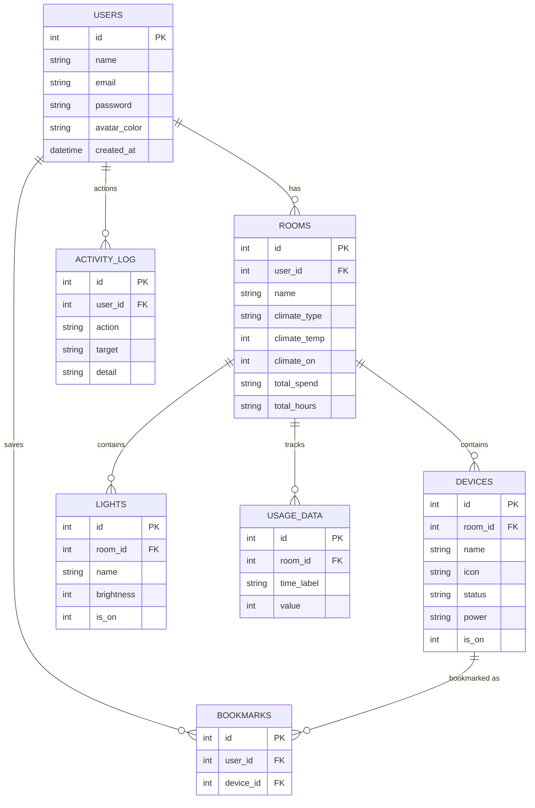
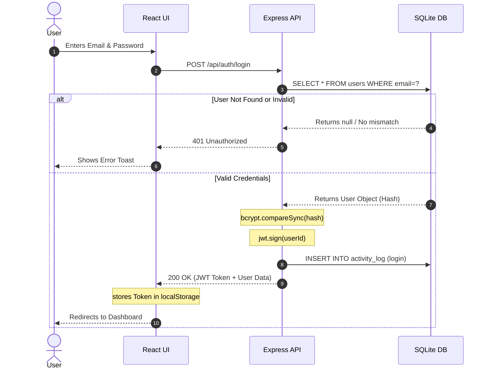
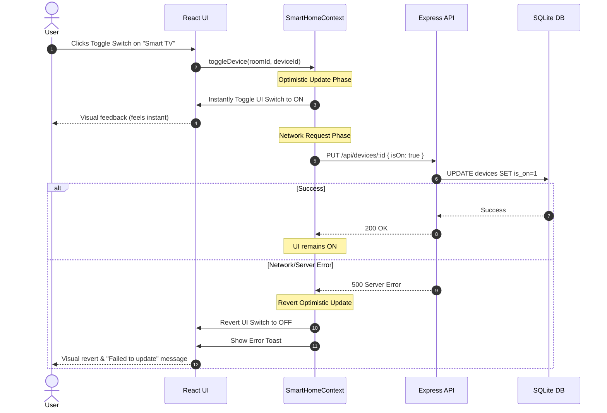

# Project System Diagrams

For your review and presentation, here are the exact technical diagrams of your Smart Home Cloud Computing project. 

> [!TIP]
> These diagrams are generated using Mermaid. You can take screenshots of these rendered diagrams directly from this document, as they contain the exact, typon-free variable and table names from your codebase (unlike AI-generated images which often misspell technical terms).

---

## 1. Entity-Relationship Diagram (ERD)
This diagram shows the complete SQLite database schema for the project, illustrating how Users, Rooms, Devices, and Logs are connected.

---

## 2. Authentication & JWT Sequence Diagram
This diagram illustrates the secure login flow and how the stateless JWT token is issued. This is highly relevant for cloud computing security.

---

## 3. IoT Device Control Data Flow (Toggle Device)
This diagram shows how the frontend performs "optimistic UI updates" to make the app feel instantly responsive when toggling a smart device.

